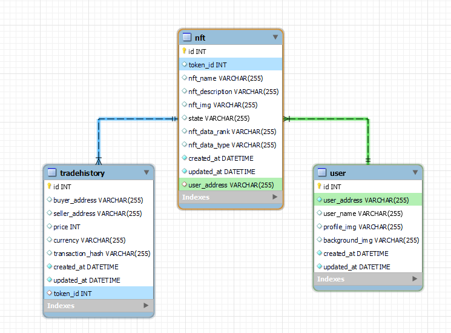
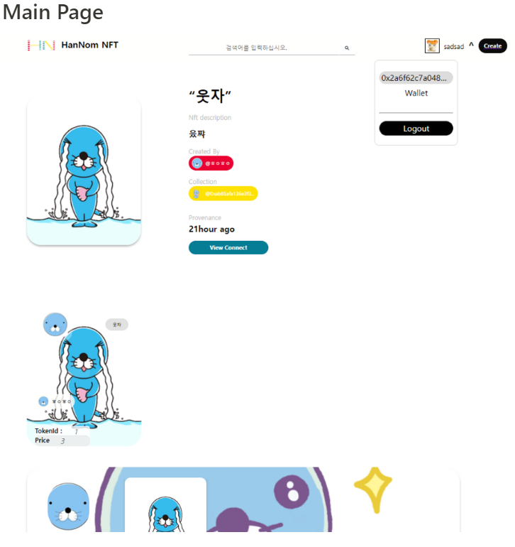
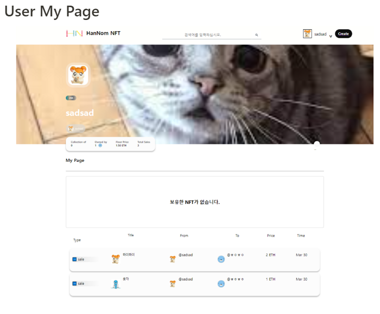
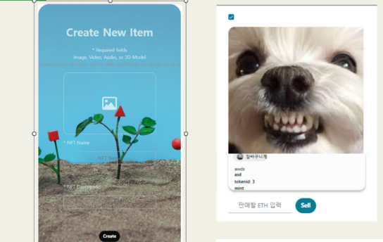
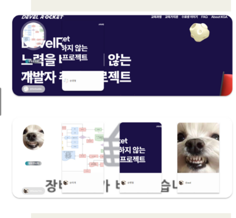
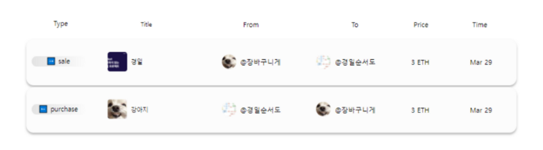
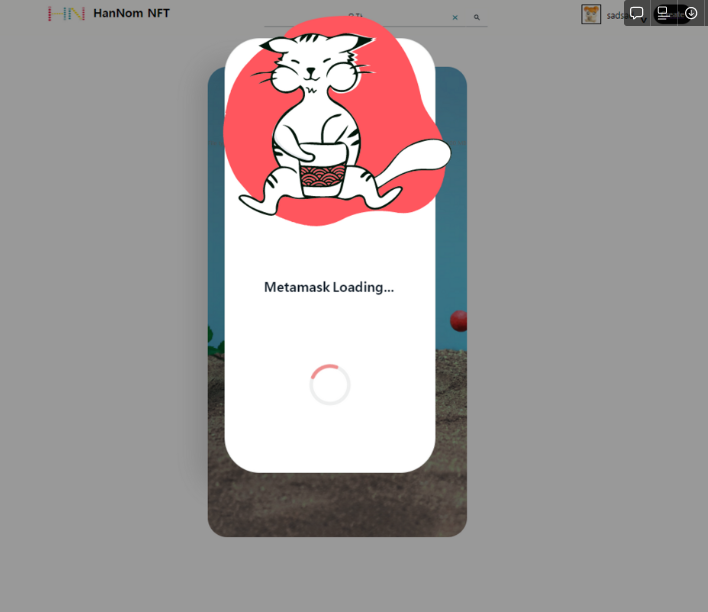

# 👨‍🔧 HanNom

NFT Team Project - nft 거래소 사이트 제작

## 🟢 프로젝트 간단요약

1. MetaMask login
2. goeril test network 연동
3. NFT Mint
4. NFT Sell, Buy
5. Pinata
6. AWS-EC2

## 🔵 DB table 설정

;

## Page 소개

---

## nft 관련 Page

## list

## trade

## 🟡 MetaMask 에서 서명할때

loading component 출력

## 🟤 역할 분담

- 팀장 : 정재훈
- 팀원 : 최원겸, 김영준, 고우석
- Front
  - 최원겸 : MainPage 작성, ui-component 작성
  - 고우석 : front axios 통신 logic 작성, react rerendering
- Back
  - 정재훈 : 전체총괄, solidity smart contract 작성
  - 김영준 : back axios 통신 logic 작성, react rerendering

## 🟣 Stack

- HTML5, CSS3, React, Redux-toolkit, Node.js, Mysql2, solidity, sequelize, figma, react-native

## 🟡 Issue

- figma, aws-amplify 라이브러리 적용

---

## 🟠 Reference

- https://opensea.io/
- https://pala.io/
